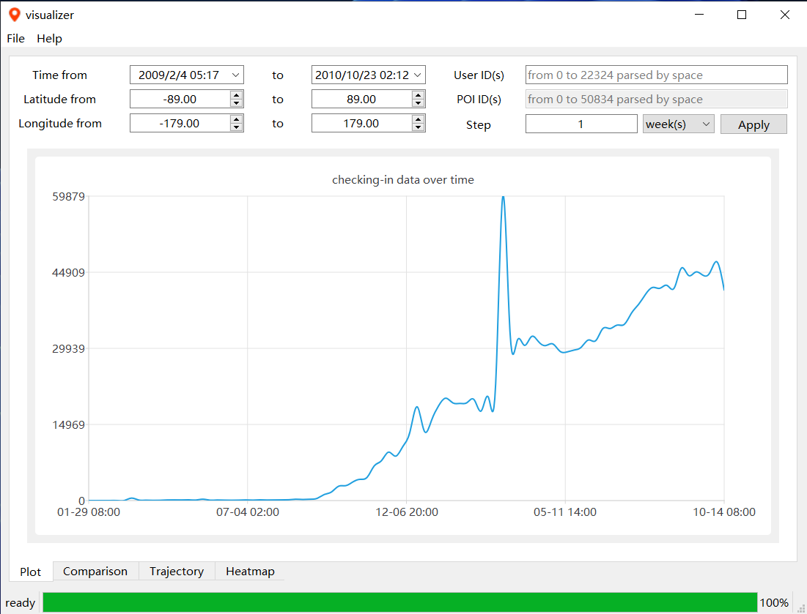
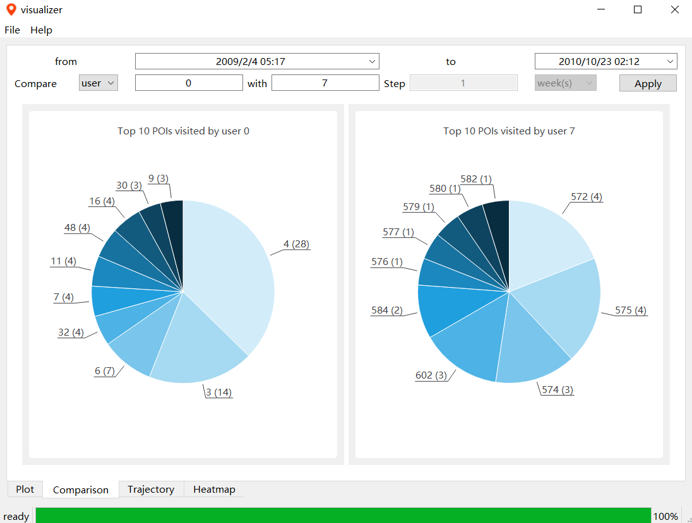
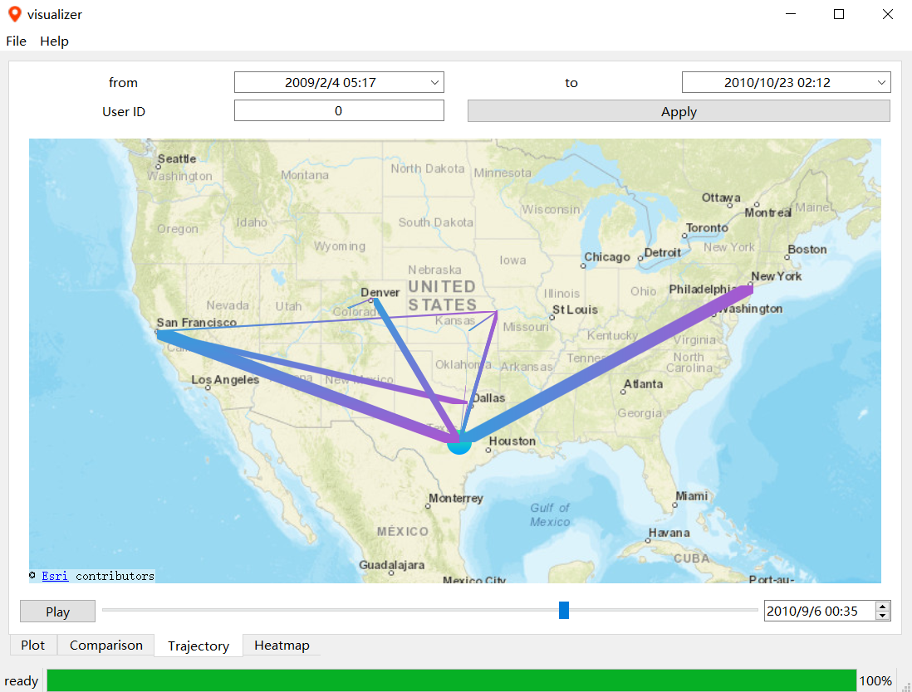
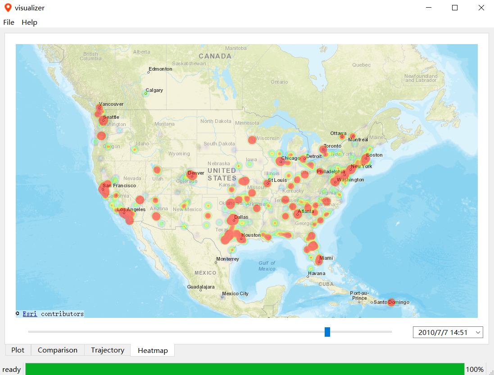

# POI Checking-in Data Visualizer

Final Project for SJTU CS2309 Problem Solving And Practice. Analysis and visualization of POI checking-in data with Qt. 

## Build and Run

- Open `visualizer.pro` in Qt Creator
- Configure the project with `Release` target
- Build and run

## Functionalities

### Chart Plot

Display spatio-temporal information with parameters tuned freely

### Information Comparison

Compare differences between two users or two POIs

### Trajectory Showing

Show trajectory of a specific user over time

### Heatmap Rendering

Display heatmap in a region with full user interaction

### Cache Mechanism

Automatically record query history for faster repeated request and cache heatmap images for smoother experience
